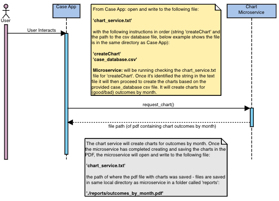

# Communication Contract
<strong>Chart Microservices for Case Management Application</strong>

<i><u>General Notes</i></u>: 

Microservice files should be saved in same directory as the Case App as communication pipe is via text files (otherwise update directory locations)

`chart_service.txt` file will serve as the communication pipe between the Case App and the Microservice.

`reports` folder will serve to save the PDF of the charts (saves in local directory).

*The microservice expects a case_database.csv file that matches the columns exactly as the example provided.

<i><u>Libraries-Dependencies</i></u>: 

`csv` [standard python library - https://docs.python.org/3/library/csv.html]

`matplotlib` [python library to assist with charts - https://matplotlib.org/]

`numpy` [python library to assist with charts - https://numpy.org/]


## Request Data
To request data (charts) to be created from the case database csv file:

 Update/replace the contents of `chart_service.txt` file with the following instructions: 
 
`createChart` : this exact string <br>
`case_database.csv` : the database csv file to create charts from (location)

```    
with open('chart_service.txt', "w") as file:
    lines = ["createChart\n", "case_database.csv\n"]
    file.writelines(lines)
```

This example call assumes the database csv file is saved in the same directory as the Case App. 

The microservice will look for the `createChart` string EXACTLY and then it will create charts from the `case_database.csv` file

## Receive Data

Charts will be saved as a PDF in the `reports` folder in the local directory.

The microservice will update the `chart_service.txt` file with the path to the PDF file after it's completed creating the charts.

To receive the path to the PDF file, read from the `chart_service.txt` after the charts have been created and saved.

```    
    with open('chart_service.txt', "r") as file:
        pdf_file_path = file.readline()
    print(pdf_file_path)
```

## UML Sequence Chart
